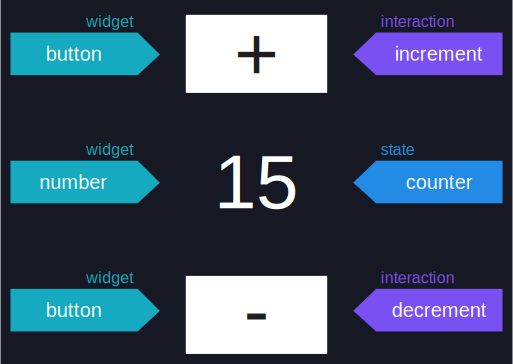
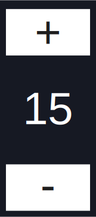

# 第一步
但是理论已经够了。是时候开始写一些代码了！

iced 采用 Elm 架构作为构建交互式应用程序最自然的方法。
因此，在使用 iced 时，我们将处理上一章中介绍的四个主要思想：
**状态**、**消息**、**更新逻辑**和**视图逻辑**。

在上一章中，我们剖析并研究了经典的计数器界面。让我们尝试
在 Rust 中构建它，同时利用 Elm 架构。

<div align="center">
  
</div>

## 状态
让我们从**状态**开始——应用程序的底层数据。

在 Rust 中，考虑到所有权和借用规则，仔细思考应用程序的数据模型
是极其重要的。

> 我鼓励您总是从思考应用程序的数据及其
  不同状态开始——不仅是那些可能的，还有那些必须不可能的。然后尽可能多地利用
  类型系统来_[使不可能的状态变得不可能]_。

对于我们的计数器界面，我们只需要一个计数器值。由于我们有增加和减少交互，
数字可能是负数。这意味着我们需要一个有符号整数。

另外，我们知道一些用户很疯狂，他们可能想要计算很多东西。让我们给他们 64 位来玩：

```rust
struct Counter {
    value: i64,
}
```

如果一个疯狂的用户每秒计算 1000 个东西，他们需要大约 3 亿年才能用完数字。
希望这就足够了。

[使不可能的状态变得不可能]: https://www.youtube.com/watch?v=IcgmSRJHu_8

## 消息
接下来，我们需要定义我们的**消息**——应用程序的交互。

我们的计数器界面有两个交互：**增加**和**减少**。从技术上讲，我们可以使用简单的布尔值来
编码这些交互：例如，`true` 表示增加，`false` 表示减少。

但是...我们在 Rust 中可以做得更好！交互是互斥的——当我们有一个交互时，我们真正拥有的是一个
可能值集合中的一个值。事实证明，Rust 有完美的数据类型来建模这种思想：_枚举_。

因此，我们可以这样定义我们的消息：

```rust
enum Message {
    Increment,
    Decrement,
}
```

足够简单！这也为我们的长期发展做好了准备。如果我们想要向应用程序添加额外的交互——比如
`Reset` 交互——我们只需向这个类型引入额外的变体。枚举非常强大和方便。

## 更新逻辑
现在，是时候编写我们的**更新逻辑**了——消息如何改变应用程序的状态。

基本上，我们需要编写一些逻辑，给定任何消息都可以相应地更新应用程序的任何状态。在 Rust 中表达这种逻辑的最简单
和最惯用的方法是在我们的应用程序状态中定义一个名为 `update` 的方法。

对于我们的计数器界面，我们只需要根据我们刚刚定义的 `Message`
正确地增加或减少我们 `Counter` 结构的 `value`：

```rust,ignore
impl Counter {
    fn update(&mut self, message: Message) {
        match message {
            Message::Increment => {
                self.value += 1;
            }
            Message::Decrement => {
                self.value -= 1;
            }
        }
    }
}
```

太好了！现在我们准备好处理用户交互了。例如，想象我们这样初始化我们的计数器：

```rust,ignore
let mut counter = Counter { value: 0 };
```

假设我们想要模拟用户玩我们的界面一会儿——按两次增加按钮
然后按一次减少按钮。我们可以使用我们的**更新逻辑**轻松计算计数器的最终状态：

```rust,ignore
counter.update(Message::Increment);
counter.update(Message::Increment);
counter.update(Message::Decrement);
```

这将导致我们的 `Counter` 最终的 `value` 为 `1`：

```rust,ignore
assert_eq!(counter.value, 1);
```

事实上，我们刚刚为我们的应用程序逻辑编写了一个简单的测试：

```rust,ignore
#[test]
fn it_counts_properly() {
    let mut counter = Counter { value: 0 };

    counter.update(Message::Increment);
    counter.update(Message::Increment);
    counter.update(Message::Decrement);

    assert_eq!(counter.value, 1);
}
```

注意这写起来多么容易！到目前为止，我们只是利用了非常简单的 Rust 概念。没有依赖项！
您甚至可能想知道..."GUI 代码在哪里？！"

这是 Elm 架构的主要优势之一。正如我们在上一章中发现的，组件是
界面中唯一本质上可重用的基本思想。到目前为止我们定义的所有部分都是特定于应用程序的，
因此根本不需要了解 UI 库！

Elm 架构正确地拥抱了用户界面每个部分的不同性质——将**状态**、
**消息**和**更新逻辑**与**组件**和**视图逻辑**解耦。

## 视图逻辑
最后，我们需要定义的唯一部分是我们的**视图逻辑**——状态如何决定应用程序的组件。

这就是魔法发生的地方！在视图逻辑中，我们将应用程序的状态及其可能的交互结合起来
产生必须向用户显示的用户界面的视觉表示。

<div align="center" class="right">
  
</div>

正如我们已经学到的，这种视觉表示由组件组成——界面的视觉上不同的单元。大多数
组件不是特定于应用程序的，它们可以被抽象并打包到可重用的库中。这些库通常
被称为_组件工具包_、_GUI 框架_或简称_GUI 库_。

这就是 **iced** 的用武之地——终于！iced 是一个用于 Rust 的跨平台 GUI 库。它打包了相当多的
现成可用的组件；包括按钮和数字。正是我们计数器所需要的。

### 按钮
我们的计数器界面有两个**按钮**。让我们看看如何使用 iced 定义它们。

在 iced 中，组件是独立的值。就像您可以在变量中有一个整数一样，您也可以有一个组件。
这些值通常使用 `widget` 模块中的_辅助函数_创建。

对于我们的按钮，我们可以使用 `button` 辅助函数：

```rust,ignore
use iced::widget::button;

let increment = button("+");
let decrement = button("-");
```

这很简单，不是吗？现在，我们只是为我们的按钮定义了几个变量。

正如我们所看到的，组件辅助函数可能需要参数来配置组件的部分以符合我们的喜好。
在这种情况下，`button` 函数接受一个用于描述按钮内容的参数。

### 数字
我们的按钮很好地放在我们的 `increment` 和 `decrement` 变量中。我们如何为
计数器值做同样的事情？

虽然 iced 实际上没有 `number` 组件，但它确实有一个更通用的 `text` 组件，可以用来
显示任何类型的文本——包括数字：

```rust,ignore
use iced::widget::text;

let counter = text(15);
```

太好了！像 `button` 一样，`text` 也接受一个用于描述其内容的参数。由于我们刚刚开始，让我们
暂时简单地硬编码 `15`。

### 布局
好的！我们在 `increment` 和 `decrement` 中有我们的两个按钮，在 `counter` 中有我们的计数器值。这应该就是一切了，对吧？

不要这么快！我们计数器界面中的组件以特定的**顺序**显示。给定我们的三个组件，总共有
**六**种不同的排序方式。然而，我们想要的顺序是：`increment`、`counter` 和 `decrement`。

描述这种顺序的一个非常简单的方法是创建一个包含我们组件的列表：

```rust,ignore
let interface = vec![increment, counter, decrement];
```

但我们仍然缺少一些东西！不仅顺序是特定的，我们的界面还有特定的视觉**布局**。

组件彼此堆叠，但它们也可以从左到右定位。在我们迄今为止的描述中，没有任何内容
谈论我们组件的**布局**。

在 iced 中，布局使用...嗯，更多组件来描述！没错。并非所有组件都直接产生视觉结果；有些可能只是
管理现有组件的位置。由于组件只是值，它们可以很好地嵌套和组合。

我们计数器需要的那种垂直布局可以通过 `column` 组件实现：

```rust,ignore
use iced::widget::column;

let interface = column![increment, counter, decrement];
```

这与我们之前的代码片段非常相似。iced 提供了一个 `column!` 宏，用于从特定
**顺序**的一些组件创建 `column`——类似于 `vec!`。

### 交互
此时，我们在 `interface` 变量中有一个表示我们计数器界面的 `column`。但如果我们实际尝试运行它，
我们会很快发现有些不对劲。

我们的按钮将完全被禁用。当然！我们还没有为它们定义任何**交互**。注意我们还没有
在视图逻辑中使用我们的 `Message` 枚举。如果我们不指定，我们的用户界面如何产生**消息**
呢？让我们现在就做。

在 iced 中，每个组件都有一个特定的类型，可以使用简单的构建器方法进行进一步配置。`button`
辅助函数返回[`Button` 类型]的实例，它有一个 `on_press` 方法，我们可以用它来定义当用户按下按钮时它必须
**产生**的消息：

```rust,ignore
use iced::widget::button;

let increment = button("+").on_press(Message::Increment);
let decrement = button("-").on_press(Message::Decrement);
```

太棒了！我们的交互已经连接好了。但还有一个小细节。按钮可以被多次按下。因此，
同一个按钮可能需要产生同一个 `Message` 的多个实例。结果，我们需要我们的 `Message` 类型是可克隆的。

我们可以轻松地_派生_ `Clone` 特征——以及 `Debug` 和 `Copy` 以防万一：

```rust
#[derive(Debug, Clone, Copy)]
enum Message {
    Increment,
    Decrement,
}
```

在 Elm 架构中，消息表示已经发生的**事件**——由纯数据组成。因此，为我们的 `Message` 类型派生 `Debug` 和 `Clone` 应该总是很容易的。

[`Button` 类型]: https://docs.rs/iced/0.12.1/iced/widget/struct.Button.html

### 视图
我们快到了！只剩下一件事要做：将我们的应用程序**状态**连接到视图逻辑。

让我们汇总到目前为止编写的所有视图逻辑：

```rust,ignore
use iced::widget::{button, column, text};

// 按钮
let increment = button("+").on_press(Message::Increment);
let decrement = button("-").on_press(Message::Decrement);

// 数字
let counter = text(15);

// 布局
let interface = column![increment, counter, decrement];
```

如果我们运行这个视图逻辑，我们现在能够按下按钮。然而，结果什么也不会发生。
计数器会卡住——总是显示数字 `15`。我们的界面完全是无状态的！

显然，这里的问题是我们的 `counter` 变量包含一个硬编码 `15` 的文本组件。相反，我们
想要的是实际显示我们 `Counter` 状态的 `value` 字段。这样，当按下按钮并
触发我们的更新逻辑时，文本组件将显示新的 `value`。

我们可以通过在我们的 `Counter` 的方法中运行我们的视图逻辑来轻松做到这一点——就像我们对更新逻辑所做的那样：

```rust,ignore
use iced::widget::{button, column, text};

impl Counter {
    fn view(&self) {
        // 按钮
        let increment = button("+").on_press(Message::Increment);
        let decrement = button("-").on_press(Message::Decrement);

        // 数字
        let counter = text(self.value);

        // 布局
        let interface = column![increment, counter, decrement];
    }
}
```

我们的 `counter` 变量现在将始终有一个带有我们 `Counter` 当前 `value` 的 `text` 组件。太好了！

然而，正如您可能注意到的，这个 `view` 方法完全没用——它构造了一个
`interface`，但然后...它什么也不做，把它扔掉了！

> 在 iced 中，构造和配置组件没有副作用。在您的视图代码中没有需要
  担心的"全局上下文"。

我们需要返回 `interface`，而不是把它扔掉。记住，我们**视图逻辑**的目的是
决定我们用户界面的组件；`interface` 变量的内容正是我们想要的
界面的描述：

```rust,ignore
use iced::widget::{button, column, text, Column};

impl Counter {
    fn view(&self) -> Column<Message> {
        // 按钮
        let increment = button("+").on_press(Message::Increment);
        let decrement = button("-").on_press(Message::Decrement);

        // 数字
        let counter = text(self.value);

        // 布局
        let interface = column![increment, counter, decrement];

        interface
    }
}
```

太棒了！注意 `view` 方法现在需要一个返回类型。返回的类型是 `Column`，因为 `column!` 宏产生
这种类型的组件——就像 `button` 产生 `Button` 类型的组件一样。

您可能还注意到这个 `Column` 类型有一个泛型类型参数。这个类型参数简单地指定
组件可能产生的消息类型。在这种情况下，它接受我们的 `Message`，因为列内的 `increment` 和 `decrement` 按钮
产生这种类型的消息。

> iced 强烈关注类型安全——利用类型系统和编译时保证来尽可能减少运行时错误。

嗯...就是这样！我们的视图逻辑完成了！但等等...现在有点冗长。由于这是一个如此简单的界面，
让我们内联所有内容：

<div align="center" class="right">
  
</div>

```rust,ignore
use iced::widget::{button, column, text, Column};

impl Counter {
    fn view(&self) -> Column<Message> {
        column![
            button("+").on_press(Message::Increment),
            text(self.value),
            button("-").on_press(Message::Decrement),
        ]
    }
}
```

这更简洁了。它甚至类似于实际的界面！由于创建组件只是产生没有
副作用的值；我们可以在视图逻辑中移动东西而不用担心破坏其他东西。没有诡异的
远距离作用！

这就是我们计数器界面的全部内容。我相信您迫不及待地想要**运行**它。我们开始吧？