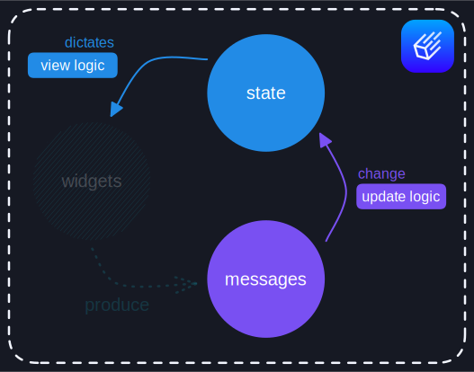

# 运行时
在上一章中，我们使用 iced 和 Elm 架构构建了经典的计数器界面。我们专注于每个
基本部分——一次一个：**状态**、**消息**、**更新逻辑**和**视图逻辑**。

但现在怎么办？是的，我们有用户界面的所有基本部分——正如我们在
[剖析过程中](architecture.md)学到的——但不清楚我们应该如何让它活起来。

看起来我们缺少_某些东西_，可以将所有部分组合在一起并让它们协调_运行_。_某些东西_可以
创建并运行用户界面的基本循环——向用户显示组件并对任何交互做出反应。

这个_某些东西_被称为**运行时**。您可以将其视为用户界面反馈循环发生的环境。运行时负责循环的每个部分：初始化**状态**、
产生**消息**、执行**更新逻辑**和运行我们的**视图逻辑**。

<div align="center">
  
</div>

> 想象运行时的另一种方式是想象一个缺少四个基本部分的巨大引擎。我们的工作是
> 填补这些部分——然后引擎就可以运行了！

## 神奇的运行时
让我们通过探索基本（虽然非常神奇！）运行时的内部来更好地理解界面的生命周期。

事实上，我们实际上已经开始编写运行时了！当[我们实现计数器的更新逻辑](first-steps.md#update-logic)时，
我们编写了一个模拟用户的非常小的测试：

```rust,ignore
#[test]
fn it_counts_properly() {
    let mut counter = Counter { value: 0 };

    counter.update(Message::Increment);
    counter.update(Message::Increment);
    counter.update(Message::Decrement);

    assert_eq!(counter.value, 1);
}
```

从技术上讲，这是一个非常基础的运行时。它初始化**状态**，产生一些**交互**，
并执行**更新逻辑**。

当然，交互是编造的，它非常短暂，并且没有涉及**视图逻辑**
——远非我们实际想要的。尽管如此，这是一个很好的开始！让我们尝试逐步扩展它。

### 初始化状态
我们的小运行时已经正确初始化了应用程序状态：

```rust,ignore
// 初始化状态
let mut counter = Counter { value: 0 };
```

但是，我们可以通过利用 `Default` 特征来避免硬编码初始状态。让我们派生它：

```rust
#[derive(Default)]
struct Counter {
    value: i64
}
```

然后，我们在运行时中简单地使用 `Counter::default`：

```rust,ignore
// 初始化状态
let mut counter = Counter::default();
```

差异可能很微妙，但我们正在分离关注点——我们将应用程序的初始状态保持在
状态定义附近，并与运行时分离。这样，我们最终可能能够让我们的运行时与
_任何_应用程序一起工作！

### 显示界面
好的！我们已经初始化了**状态**。接下来是什么？嗯，在用户可以与我们的界面**交互**之前，我们
需要向他们**显示**它。

这很容易！我们只需要在用户运行的任何操作系统中打开一个窗口，初始化适当的图形后端，
然后渲染我们**视图逻辑**返回的组件——当然要正确布局！

什么？您不知道如何做到这一点？别担心，我有这个神奇的函数：`display`。它接受任何界面的引用并将其显示给用户。它完全有效！

```rust,ignore
use magic::display;

# // 初始化状态
# let mut counter = Counter::default();
#
// 运行我们的视图逻辑以获得我们的界面
let interface = counter.view();

// 向用户显示界面
display(&interface);
```

看？简单！玩笑归玩笑，本章的目的不是让我们学习图形编程；而是让我们
更好地理解运行时是如何工作的。一点魔法不会有害！

### 收集交互
用户正在看我们的界面并与之交互。我们需要非常注意所有
交互并产生我们的组件指定的所有相关**消息**。

如何？当然是用更多的魔法！我刚刚在我的礼帽里找到了这个 `interact` 函数——它接受一个
界面并产生对应于用户最新交互的**消息**。

```rust,ignore
use magic::{display, interact};

# // 初始化状态
# let mut counter = Counter::default();
#
# // 运行我们的视图逻辑以获得我们的界面
# let interface = counter.view();
# 
# // 向用户显示界面
# display(&interface);
#
// 处理用户交互并获得我们的消息
let messages = interact(&interface);
```

太好了！`interact` 为我们返回一个**消息**列表——准备好被迭代。

### 对交互做出反应
此时，我们已经收集了用户交互并将它们转换为一堆**消息**。为了
正确地对用户做出反应，我们需要为每个消息相应地更新我们的**状态**。

幸运的是，这一步不涉及更多的魔法技巧——我们可以只使用我们的**更新逻辑**：

```rust,ignore
# use magic::{display, interact};
#
# // 初始化状态
# let mut counter = Counter::default();
#
# // 运行我们的视图逻辑以获得我们的界面
# let interface = counter.view();
# 
# // 向用户显示界面
# display(&interface);
#
# // 处理用户交互并获得我们的消息
# let messages = interact(&interface);
#
// 通过处理每个消息来更新我们的状态
for message in messages {
    counter.update(message);
}
```

这应该让我们的状态与最新的用户交互完全保持同步。

### 循环
好的！我们的状态已经更新以反映用户交互。现在，我们需要再次向用户显示结果界面。之后，我们必须处理任何进一步的交互...然后，再次更新我们的状态。
然后...再次重复这一切！

这是一个循环！不，循环并不是很神奇——至少当我们编写 Rust 时不是：

```rust,ignore
use magic::{display, interact};

// 初始化状态
let mut counter = Counter::default();

// 保持交互。一直如此！
loop {
    // 运行我们的视图逻辑以获得我们的界面
    let interface = counter.view();

    // 向用户显示界面
    display(&interface);

    // 处理用户交互并获得我们的消息
    let messages = interact(&interface);

    // 通过处理每个消息来更新我们的状态
    for message in messages {
        counter.update(message);
    }
}
```

恭喜！我们刚刚编写了一个完全功能的运行时——除了神奇的属性。我们可以清楚地理解这里
Elm 架构的每个基本部分如何适应应用程序的生命周期。

具体来说，

- **状态**初始化一次，
- **视图逻辑**在启动时运行一次，然后在每批交互后运行，
- **更新逻辑**为每个创建**消息**的交互运行。

## 冰雪法师
"这很酷"，您说，"但我不是法师，我仍然不知道如何运行我编写的计数器界面。
我有东西要计算！"

很公平！iced 实现了一个与我们刚刚构建的非常相似的运行时。它自带
自己的魔法[^magic]——所以您不需要担心自己学习黑暗艺术。

如果我们想要运行我们的 `Counter`，我们所要做的就是调用 [`run`]：

```rust,ignore,iced(height=100px)
# use iced::widget::{button, column, text, Column};
# 
pub fn main() -> iced::Result {
    iced::run("一个酷炫的计数器", Counter::update, Counter::view)
}
# 
# #[derive(Default)]
# struct Counter {
#     value: i64,
# }
# 
# #[derive(Debug, Clone, Copy)]
# enum Message {
#     Increment,
#     Decrement,
# }
# 
# impl Counter {
#     fn update(&mut self, message: Message) {
#         match message {
#             Message::Increment => {
#                 self.value += 1;
#             }
#             Message::Decrement => {
#                 self.value -= 1;
#             }
#         }
#     }
# 
#     fn view(&self) -> Column<Message> {
#         column![
#             button("+").on_press(Message::Increment),
#             text(self.value),
#             button("-").on_press(Message::Decrement),
#         ]
#     }
# }
```

我们只是给我们的应用程序一个_酷炫_的标题，然后向
**运行时**提供**更新逻辑**和**视图逻辑**——然后它会处理其余的事情！

运行时能够从我们**更新逻辑**和**视图逻辑**的类型签名中推断出
**状态**和**消息**的类型。**状态**使用 `Default` 初始化，正如我们之前描述的。

还要注意 [`run`] 可能失败，因此它返回一个 [`iced::Result`]。如果我们所做的只是运行
应用程序，我们可以在 `main` 中直接返回这个结果。

就是这样！享受计算东西的乐趣吧——至少 3 亿年！

[`run`]: https://docs.iced.rs/iced/fn.run.html
[`iced::Result`]: https://docs.iced.rs/iced/type.Result.html
[^magic]: 主要是 [`winit`]、[`softbuffer`]、[`wgpu`]、[`tiny-skia`] 和 [`cosmic-text`]。

[`winit`]: https://github.com/rust-windowing/winit
[`softbuffer`]: https://github.com/rust-windowing/softbuffer
[`wgpu`]: https://github.com/gfx-rs/wgpu
[`tiny-skia`]: https://github.com/RazrFalcon/tiny-skia
[`cosmic-text`]: https://github.com/pop-os/cosmic-text

> #### 作者的话
> 您已经到达了本书的结尾，目前为止！
>
> 我认为它应该已经作为库基础知识的快速介绍。
> 还有很多东西需要揭示——但希望您现在已经到了可以开始
> 玩耍、享受乐趣和进一步实验的地步。
>
> 这本书远未完成——我想在这里涵盖更多主题，即：
>
>   - 布局
>   - 样式
>   - 并发
>   - 扩展应用程序
>   - 扩展运行时
>   - 以及更多！
>
> 在我写完它们之前，如果您想要探索和进一步学习，请查看[其他资源](additional-resources.md)
> 章节。
>
> 我希望您到目前为止享受阅读。敬请期待！
>
> — Héctor